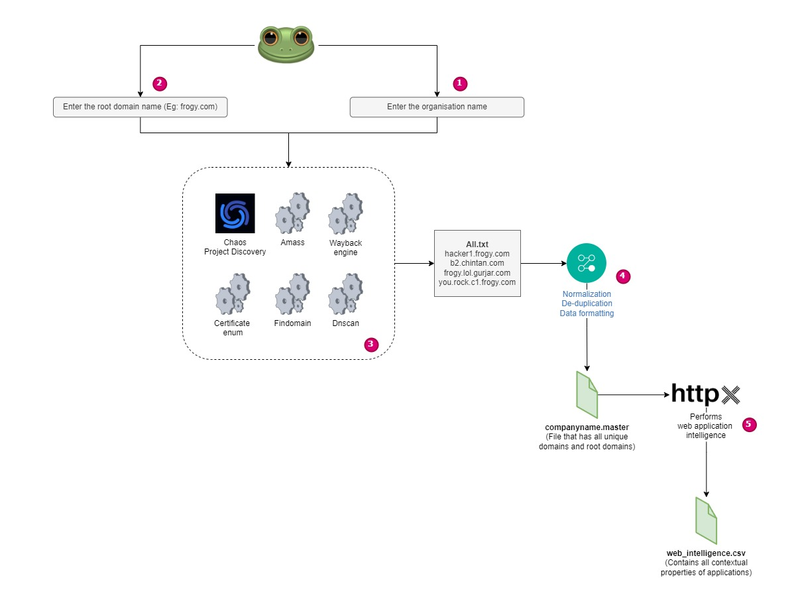
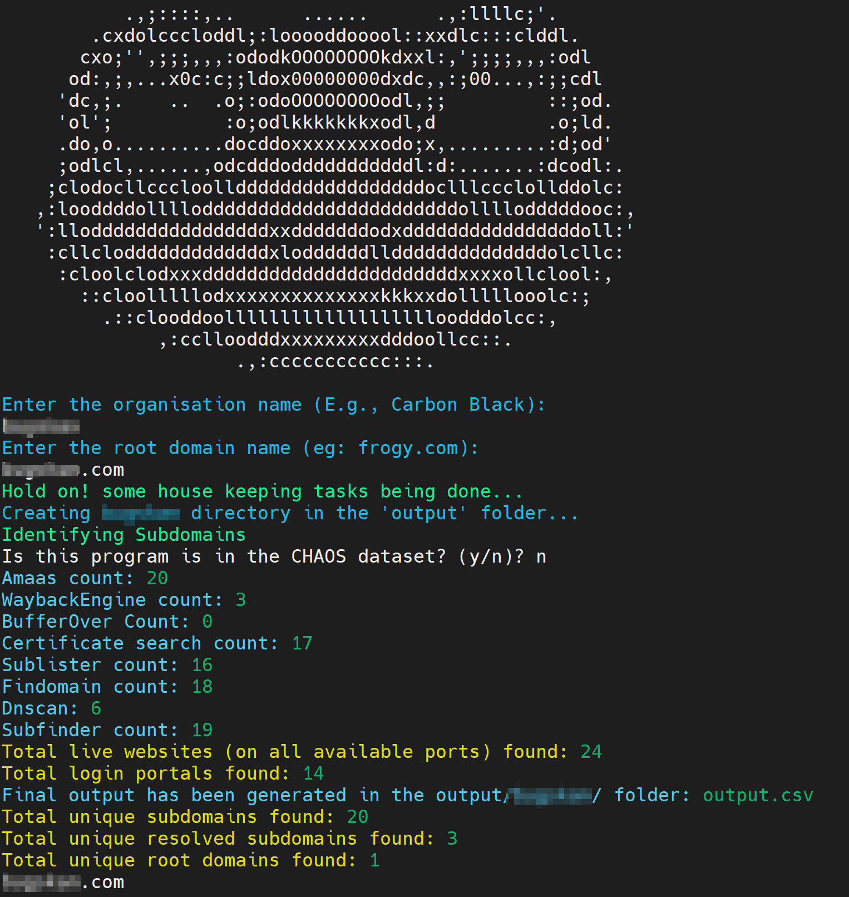

           .,;::::,..      ......      .,:llllc;'.
        .cxdolcccloddl;:looooddooool::xxdlc:::clddl.
       cxo;'',;;;,,,:ododkOOOOOOOOkdxxl:,';;;;,,,:odl
      od:,;,...x0c:c;;ldox00000000dxdc,,:;00...,:;;cdl
     'dc,;.    ..  .o;:odoOOOOOOOOodl,;;         ::;od.
     'ol';          :o;odlkkkkkkkxodl,d          .o;ld.
     .do,o..........docddoxxxxxxxxodo;x,.........:d;od'
     ;odlcl,......,odcdddodddddddddddl:d:.......:dcodl:.
    ;clodocllcccloolldddddddddddddddddoclllccclollddolc:
					``` in progress ```

**Use Cases:**

- **Vulnerability Management Team:** Enhance vulnerability scanning coverage by incorporating discovered subdomains into the asset database.
- **Threat Intel Team:** Prioritize proactive monitoring for critical assets by including subdomain enumeration results in the intelligence database.
- **Asset Inventory Team:** Keep the asset inventory up-to-date by adding newly discovered subdomains and finding contact information for internal assets.
- **SOC Team:** Identify monitored assets and expand coverage using subdomain enumeration results.
- **Patch Management Team:** Identify and manage legacy or abandoned assets by leveraging subdomain enumeration findings.<br/>

# **Logic** <br/>


**Features** <br/>
    :frog: Perform horizontal subdomain enumeration <br/>
    :frog: Conduct vertical subdomain enumeration <br/>
    :frog: Resolve subdomains to their corresponding IP addresses <br/>
    :frog: Identify live web applications <br/> 
    :frog: Gather comprehensive contextual information about web applications, including title, content length, server, IP, CNAME, and more, using httpx. <br/>
	
+ **Requirements:** Go Language, Python 3.+, jq<br/>
You can check to see if you have these by typing into terminal:
  ``` go version```
  ```python --version```
  ```jq --version```

**To install Go:**<br/>
  ```sudo apt update && sudo apt install -y golang```
  <br/>
  Arch:<br/>
  ```sudo pacman -Syu go```
  <br/>
  Mac:<br/>
  ```brew install go```
  ```port install go```
  <br/>
  Windows:<br/>
  ```scoop install go```
  ```choco install golang```
  ```winget install golang```
  <br/>
**To install Python:**<br/>
  ```Debian and Ubuntu: sudo apt install python3```
  ```Arch: sudo pacman -S python3```
  <br/>
**To install jq:**<br/>
  Debian and Ubuntu:<br/>
  ```sudo apt update && sudo apt install jq```
  <br/>
  Arch:<br/>
  ```sudo pacman -S jq```
  <br/>
  Mac:<br/>
  ```brew install jq```
  ```port install jq```
  <br/>
  Windows:<br/>
  ```winget install jqlang.jq```
  ```scoop install jq```
  ```chocolatey install jq```
    
+ **Installation**
    ```sh
  Login as root and run the below command.
  bash install.sh
    ```
+ **Usage**
    ```sh
    ./frogy.sh
    ```
	
+ **Demo**


+ **Output**
    ```
    Output file will be saved inside the output/company_name/outut.csv folder. Where company_name is any company name which you give as an input to 'Organization Name' at the start of the script.
	```
**Credits**
Chintan Gurjar for the initial implementation.
https://github.com/iamthefrogy/frogy